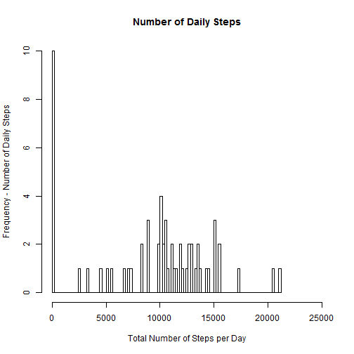
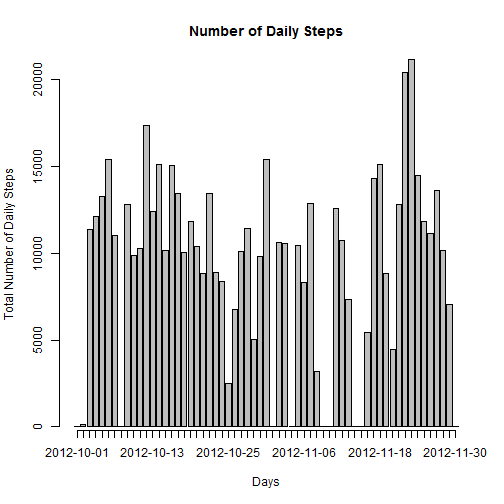
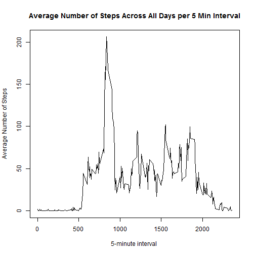
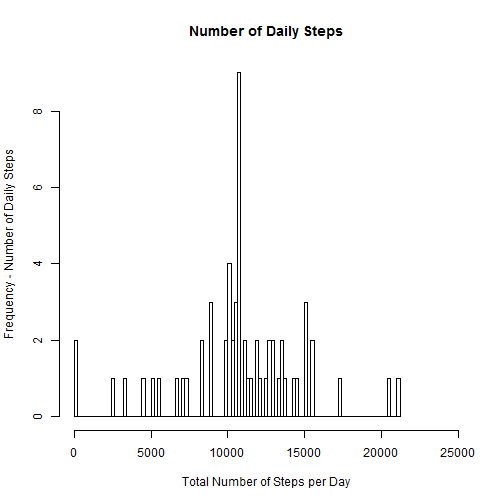
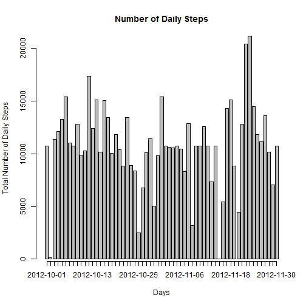
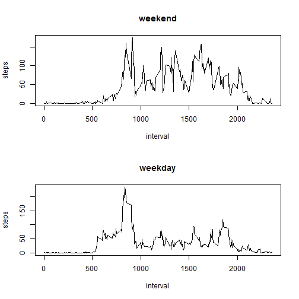

## Loading and preprocessing the data


```r
data <- read.csv("activity.csv", header = TRUE)
```

## What is mean total number of steps taken per day?

1.Calculate the total number of steps taken per day


```r
total <- aggregate(data$steps, list(data$date), FUN=sum, na.rm=TRUE)

names(total) <- c("date", "steps")
head(total)
```

```
##         date steps
## 1 2012-10-01     0
## 2 2012-10-02   126
## 3 2012-10-03 11352
## 4 2012-10-04 12116
## 5 2012-10-05 13294
## 6 2012-10-06 15420
```


2.If you do not understand the difference between a histogram and a barplot, research the difference between them. Make a histogram of the total number of steps taken each day


Use hist(), it shows that "Frequency" of the steps total of each day.


```r
hist(total$steps, breaks = 100 
             ,xlab = c("Total Number of Steps per Day")
             ,xlim = c(0,25000)
             , ylab = c("Frequency - Number of Daily Steps")
             ,main = "Number of Daily Steps"
        )
```

 

Use barplot(), it can shows that "each day" as X-axis


```r
total$date <- as.Date(total$date)
b <- barplot(total$steps
             ,names.arg = total$date
             ,xlab = c("Days")
             , ylab = c("Total Number of Daily Steps")
             ,main = "Number of Daily Steps"
             ,axis.lty=1)
```

 


3.Calculate and report the mean and median of the total number of steps taken per day


```r
mean(total$step)
```

```
## [1] 9354.23
```

```r
median(total$step)
```

```
## [1] 10395
```


## What is the average daily activity pattern?


1.Make a time series plot (i.e. type = "l") of the 5-minute interval (x-axis) and the average number of steps taken, averaged across all days 


```r
average <- aggregate(data$steps, list(data$interval), FUN=mean, na.rm=TRUE)
names(average) <- c("interval","steps")

plot(average$interval, average$steps, type = "l"
     ,xlab = "5-minute interval "
             ,ylab = "Average Number of Steps"
)
 title("Average Number of Steps Across All Days per 5 Min Interval")
```

 


2.Which 5-minute interval, on average across all the days in the dataset, contains the maximum number of steps?


```r
summary(average)
```

```
##     interval          steps        
##  Min.   :   0.0   Min.   :  0.000  
##  1st Qu.: 588.8   1st Qu.:  2.486  
##  Median :1177.5   Median : 34.113  
##  Mean   :1177.5   Mean   : 37.383  
##  3rd Qu.:1766.2   3rd Qu.: 52.835  
##  Max.   :2355.0   Max.   :206.170
```

```r
n<-which.max(average$step)
average[n,]
```

```
##     interval    steps
## 104      835 206.1698
```


## Imputing missing values

1.Calculate and report the total number of missing values in the dataset (i.e. the total number of rows with NAs)


```r
colSums(is.na(data))
```

```
##    steps     date interval 
##     2304        0        0
```

2.Devise a strategy for filling in all of the missing values in the dataset. The strategy does not need to be sophisticated. For example, you could use the mean/median for that day, or the mean for that 5-minute interval, etc.


I use the mean for that 50minut interval.


3.Create a new dataset that is equal to the original dataset but with the missing data filled in.


```r
newdata <- data
newdata$steps <- ifelse(is.na(data$steps), average$steps, data$steps)
colSums(is.na(newdata))
```

```
##    steps     date interval 
##        0        0        0
```

4.Make a histogram of the total number of steps taken each day and Calculate and report the mean and median total number of steps taken per day. Do these values differ from the estimates from the first part of the assignment? What is the impact of imputing missing data on the estimates of the total daily number of steps?


```r
total2 <- aggregate(newdata$steps, list(newdata$date), FUN=sum, na.rm=TRUE)

names(total2) <- c("date", "steps")
head(total2)
```

```
##         date    steps
## 1 2012-10-01 10766.19
## 2 2012-10-02   126.00
## 3 2012-10-03 11352.00
## 4 2012-10-04 12116.00
## 5 2012-10-05 13294.00
## 6 2012-10-06 15420.00
```


Use hist(), it shows that "Frequency" of the steps total of each day.


```r
hist(total2$steps, breaks = 100 
             ,xlab = c("Total Number of Steps per Day")
             ,xlim = c(0,25000)
             , ylab = c("Frequency - Number of Daily Steps")
             ,main = "Number of Daily Steps"
        )
```

 

Use barplot(), it can shows that "each day" as X-axis


```r
total2$date <- as.Date(total2$date)
b <- barplot(total2$steps
             ,names.arg = total2$date
             ,xlab = c("Days")
             , ylab = c("Total Number of Daily Steps")
             ,main = "Number of Daily Steps"
             ,axis.lty=1)
```

 


```r
mean(total2$step)
```

```
## [1] 10766.19
```

```r
median(total2$step)
```

```
## [1] 10766.19
```

## Do these values differ from the estimates from the first part of the assignment?

yes
    


## What is the impact of imputing missing data on the estimates of the total daily number of steps?


```r
mean(total$step)-mean(total2$step)
```

```
## [1] -1411.959
```

```r
median(total$step)-median(total2$step)
```

```
## [1] -371.1887
```

## Are there differences in activity patterns between weekdays and weekends?


1.Create a new factor variable in the dataset with two levels - "weekday" and "weekend" indicating whether a given date is a weekday or weekend day.


```r
daytype <- function(date) {
    if (weekdays(as.Date(date)) %in% c("Saturday", "Sunday")) {
        "weekend"
    } else {
        "weekday"
    }
}

data$date <- as.Date(data$date)
data$daytype <- as.factor(sapply(data$date, daytype))
```

2.Make a panel plot containing a time series plot (i.e. type = "l") of the 5-minute interval (x-axis) and the average number of steps taken, averaged across all weekday days or weekend days (y-axis). See the README file in the GitHub repository to see an example of what this plot should look like using simulated data.


```r
par(mfrow = c(2, 1))
for (type in c("weekend", "weekday")) {
    steps.type <- aggregate(steps ~ interval, data = data, subset = data$daytype == 
        type, FUN = mean)
    plot(steps.type, type = "l", main = type)
}
```

 

